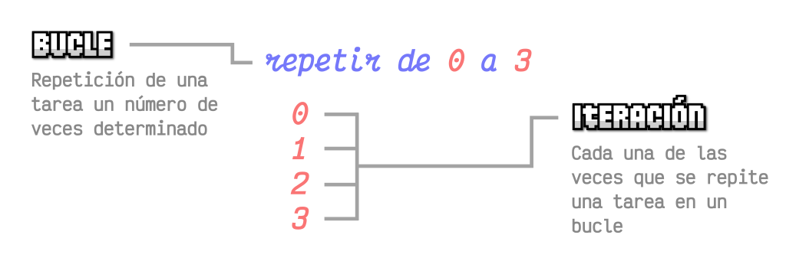

# Checkpoint 8

## ¿Qué tipo de bucles hay en JS?
En JavaScript existen varios tipos de bucles (o loops) que se utilizan para repetir bloques de código. Hay muchos diferentes tipos de bucles, pero esencialmente, todos hacen lo mismo: repiten una acción varias veces.

Existe la posibilidad de cometer un error creando el bucle y se convierta en un bucle infinito (una situación donde el programa se queda eternamente en bucle y nunca termina). Para evitarlo, siempre se debe comprobar que existe un ```incremento``` (o ``decremento```) y que en algún momento la condición va a ser falsa y se podrá salir del bucle.


[Fuente:LenguajeJS](https://lenguajejs.com/fundamentos/bucles-e-iteraciones/que-son/)

Se pueden clasificar principalmente en bucles clásicos y bucles modernos para iterar colecciones.

### 1. Bucles Tradicionales

**for**
<br>
Es el más clásico, útil cuando sabes cuántas veces quieres iterar, permitiendo control total sobre inicio, condición y paso.

*Ejemplo:*
```
// for (inicialización; condición; incremento)
for (let i = 0; i < 5; i++) {
  console.log("Valor de i:", i);
}
```

*Resultado:*
```
Valor de i: 0
Valor de i: 1
Valor de i: 2
Valor de i: 3
Valor de i: 4

Undefined
```
La sintaxis del bucle ```for``` es mucho más práctica porque te obliga a escribir la *inicialización*, la *condición* y el *incremento* antes del propio bucle, y eso ayuda a no olvidar estos tres puntos fundamentales, cosa que puede ocurrir en los bucles ```while```, causando un bucle infinito. Aunque también puede ocurrir en el bucle ```for```, suele ser menos habitual.

**while**
<br>
Ejecuta un bloque de código mientras una condición específica sea verdadera. La condición se evalúa antes de ejecutar el código.

*Ejemplo:*
```
let i = 0;  // Inicialización de la variable contador

// Condición: Mientras la variable contador sea menor de 5
while (i < 5) {
  console.log("Valor de i:", i);

  i = i + 1; // Incrementamos el valor de i
}
```

*Resultado:*
```
Valor de i: 0
Valor de i: 1
Valor de i: 2
Valor de i: 3
Valor de i: 4

5
```

**do...while**
<br>
Es una variación del bucle ```while```. La diferencia fundamental, a parte de variar un poco la sintaxis, es que este tipo de bucle siempre se ejecuta al menos una vez (ya que la condición se evalúa después de ejecutar el cuerpo del bucle), al contrario que el bucle ```while``` que en algún caso podría no ejecutarse nunca.

*Ejemplo:*
```
let i = 5;

do {
  console.log("Hola a todos");
  i = i + 1;
} while (i < 5);

console.log("Bucle finalizado");
```

*Resultado:*
```
Hola a todos
Bucle finalizado
```
En el ejemplo, en lugar de utilizar un ```while``` desde el principio junto a la condición, se escribe ```do```.
El ```while``` con la condición se traslada al final del bucle. En este caso el interior del bucle se realiza siempre, y sólo se analiza la condición al terminar el bucle, por lo que aunque no se cumpla, se va a realizar al menos una vez.

### 2. Bucles Modernos e Iteradores (ES6+)

En ES6 (ECMAScript 2015) y versiones posteriores, JavaScript introdujo formas más modernas y expresivas de iterar sobre datos. Esto incluye nuevos bucles y el concepto de iteradores e iterables.

**for...of**
<br>
Se utiliza para iterar sobre valores de objetos iterables, como arrays, strings, etc. Devuelve el valor de cada elemento directamente. Una ventaja frente al ```for``` clásico es que ```for...of``` ofrece un aspecto más limpio del código.

*Ejemplo:*
```
const arr = [10, 20, 30];

for (const value of arr) {
  console.log(value);
}
```

*Resultado:*
```
10
20
30
```

**for...in**
<br>
Se utiliza para iterar sobre las propiedades enumerables (claves) de un objeto. Aunque puede usarse en arrays, se recomienda for...of para ellos.

*Ejemplo:*
```
const objeto = {a: 1, b: 2, c: 3};
for (const propiedad in objeto) {
    console.log(propiedad + ": " + objeto[propiedad]);
}
```

*Resultado:*
```
a: 1
b: 2
c: 3
```
Es importante saber reconocer la diferencia entre ```for...of```(valores) y ```for...in```(propiedades/keys). El primero se utiliza con iterables (arrays, strings, maps, sets…), mientras que el segundo se usa principalmente con objetos.

```
// for...of → valores
for (const val of arr)

// for...in → claves (índices en arrays)
for (const key in arr)
```

**Métodos de arrays**
<br>
Aunque es un método de array existe ```forEach```, una forma muy común de iterar sobre arrays, recibiendo una función de callback para cada elemento.

*Ejemplo:*
```
[1, 2, 3].forEach(n => console.log(n));

```

*Resultado:*
```
1
2
3
```

Para finalizar, la siguiente tabla es un pequeño esquema sobre los bucles mencionados:
| **Tipo de bucle** | **Descripción** | 
|--------------|--------------|
| for      | Bucles clásicos por excelencia.      | 
| while       | Bucles simples.       | 
| do...while      | Bucles simples que se realizan siempre como mínimo una vez.      | 
| for...in      | Bucles sobre posiciones de un array.       | 
| for...of      | Bucles sobre elementos de un array.       | 
| métodos de arrays     | Bucles específicos sobre arrays.       | 

## ¿Cuáles son las diferencias entre const, let y var?

Antes de hablar de las diferencias, conviene conocer cada declaración por separado:

**var**
<br>
Es la palabra clave original utilizada para declarar variables en JavaScript, y ha existido desde que se introdujo el lenguaje por primera vez. También es la más flexible de las tres palabras clave, ya que permite declarar la misma variable varias veces y reasignarle valores.

Una de las desventajas de ```var``` es que el *ámbito de función* es global (global scope). Esto significa que una variable declarada con var está disponible en toda la función en la que se declara. Si se declara una variable dentro de un bloque o bucle, sigue estando disponible fuera de ese bloque o bucle, lo que puede dar lugar a resultados inesperados al intentar reutilizar nombres de variables o al trabajar con funciones anidadas.

*Ejemplo:*
```
var euros = 10;

function getEuros() {
  return euros;
}

console.log(euros);

```

*Resultado:*
```
10
```

**let**
<br>
Es una palabra clave relativamente nueva introducida en ES6 (sexta versión del estándar de JavaScript, lanzada en 2015 para modernizar el lenguaje). Se introdujo para resolver algunos de los problemas asociados con ```var```. La principal diferencia entre ```let``` y ```var``` es que ```let``` tiene *ámbito de bloque*. Esto significa que una variable declarada con ```let``` sólo está disponible dentro del bloque en el que se declara. Si se declara una variable dentro de un bloque o bucle, no estará disponible fuera de ese bloque o bucle.
<br>
Otra diferencia es que no se puede declarar la misma variable varias veces utilizando ```let```. Esto puede ayudar a prevenir conflictos de nombres y hacer el código más legible.

*Ejemplo:*
```
if (true) {
  let mensaje = "Hola";
  console.log(mensaje);
}

console.log(mensaje); // Dará error porque no existe fuera del bloque
```

*Resultado:*
```
Hola

Uncaught ReferenceError: mensaje is not defined
```

**const**
<br>
Es otra palabra clave introducida en ES6, y se utiliza para declarar constantes. Una constante es un valor que no puede ser reasignado una vez que ha sido declarado. Esto puede ser útil cuando se trabaja con valores que nunca deben cambiar, como las constantes matemáticas o las opciones de configuración. En pocas palabras, permite crear «compartimentos» similares a una variable, salvo que los valores que contiene no pueden ser modificados.

*Ejemplo:*
```
const persona = {
  nombre: "Ana",
  edad: 20
};

persona.edad = 21; // Pueden modificarse propiedades internas, pero no reasignar el objeto completo
console.log(persona);
```

*Resultado:*
```
nombre: 'Ana' 
edad: 21
```

Por lo tanto, en JavaScript, ```var```, ```let``` y ```const``` se usan para declarar variables, pero tienen diferencias clave en alcance (scope), reasignación y elevación (hoisting). ```var``` tiene alcance de función y es permisiva; ```let``` tiene alcance de bloque y permite reasignar valores; ```const``` también es de bloque pero no permite reasignar valor. Se recomienda usar ```const``` por defecto, ```let``` si la variable cambia y evitar ```var``` (es la palabra clave más flexible, pero también la más propensa a errores para declarar variables en JavaScript). 


[Fuente:constletvar](http://constletvar.com)

## ¿Qué es una función de flecha?
Las Arrow functions o funciones de flecha son una forma corta y compacta de escribir las funciones tradicionales de Javascript. A grandes rasgos, se trata de eliminar la palabra function y añadir el texto ```=>``` antes de abrir las llaves.


*Ejemplo:*
```
// Función tradicional
function sumar(a, b) {
  return a + b;
}

// Función de flecha equivalente
const sumar = (a, b) => a + b;
```

Las funciones de flecha hacen que el código sea mucho más legible y claro de escribir, mejorando la productividad a la hora de escribir nuestro código. También tienen las siguientes diferencias técnicas respecto a las funciones tradicionales:

**1. Sintaxis concisa**
<br>
Si solo hay una expresión, no necesitas return ni llaves {}.

**2. No tiene su propio this**
<br>
A diferencia de las funciones regulares, las funciones flecha no tienen su propio ```this```, lo heredan del contexto en el que fueron creadas.

**3. Funciones Anónimas**
<br>
Por lo general, se almacenan en variables para invocarse, ya que no tienen nombre por sí mismas.

**4. Ideal para funciones pequeñas**
<br>
Muy usadas en callbacks.

*Ejemplo:*
```
setTimeout(() => {
  console.log("Hola después de 2 segundos");
}, 2000);
```

*Resultado:*
```
Hola después de 2 segundos
```

## ¿Qué es la deconstrucción de variables?


La deconstrucción de variables (o *destructuring*) es una técnica en programación que permite extraer valores de estructuras de datos (como arrays u objetos) y asignarlos directamente a variables de forma más clara y concisa.

*Ejemplo:*
```
const personaje = {
  nombre: "Shadow",
  rol: "Ninja",
  lvl: 25
}

const { nombre, rol, lvl } = personaje

console.log(nombre);
console.log(`${rol}, lvl ${lvl}`)
```

*Resultado:*
```
Shadow
Ninja, lvl 25
```
En el ejemplo, se separan las propiedades ```nombre```, ```rol``` y ```lvl``` en variables individuales, «sacándolas» de ```usuario```.

### Ventajas y usos

**1. Código más limpio y legible**
<br>
La deconstrucción reduce la cantidad de líneas de código necesarias para extraer propiedades de un objeto.

**2. Asignación simultánea** 
<br>
Permite asignar múltiples variables en una sola línea, haciendo el código más compacto.

**3. Valores por defecto** 
<br>
La deconstrucción permite asignar valores por defecto a variables si la propiedad no existe en el objeto.

*Ejemplo:*
```
const { nombre, rol = "principiante", lvl = 1, ciudad = "Grandia"} = personaje;

console.log({ nombre, rol, lvl, ciudad });
```

*Resultado:*
```
{nombre: 'Shadow', rol: 'Ninja', lvl: 25, ciudad: 'Grandia'}
```

**4. Renombrado de variables**
<br>
Se pueden renombrar las variables al deconstruir, lo que es útil para evitar conflictos de nombres.

*Ejemplo:*
```
const { nombre, rol: tipo, lvl } = personaje;

console.log({ nombre, tipo, lvl });
```

*Resultado:*
```
{nombre: 'Shadow', tipo: 'Ninja', lvl: 25}
```
**5. Deconstrucción con parámetros de función**
<br>
Es especialmente útil cuando se trabaja con parámetros de funciones, ya que permite pasar objetos completos y deconstruir sus propiedades directamente en la función. En el siguiente ejemplo, la función ```mostrarInformacion`` recibe un objeto y deconstruye sus propiedades directamente en los parámetros.

*Ejemplo:*
```
function mostrarInformacion({ nombre, rol, lvl }) {
  console.log(`Nombre: ${nombre}`);
  console.log(`Rol: ${rol}`);
  console.log(`Lvl: ${lvl}`);
}

const personaje = {
  nombre: 'Shadow',
  rol: 'Ninja',
  lvl: 25
};

mostrarInformacion(personaje);
```

*Resultado:*
```
Nombre: Shadow
Rol: Ninja
Lvl: 25
```
**6. Intercambio de Variables**
<br>
Es una forma rápida de cambiar los valores entre dos variables sin usar una variable auxiliar, creando un array temporal ```[b, a]```, se asigna a ```[a, b]``` intercambiando automáticamente los valores. Puede verse más claro en el siguiente ejemplo:

*Ejemplo:*
```
let nombre = "Shadow";
let rol = "Ninja";
let lvl = 25;
[nombre, rol, lvl] = [rol, nombre, lvl];
```

*Resultado:*
```
nombre = "Ninja"
rol = "Shadow"
lvl = 25 // no cambia
```

En resumen, la deconstrucción en JavaScript es una característica poderosa que mejora la legibilidad y eficiencia del código. Permite extraer propiedades de objetos de manera concisa, asignar valores por defecto, renombrar variables y trabajar con objetos anidados y parámetros de funciones. Su uso adecuado puede simplificar considerablemente la manipulación de datos, especialmente en aplicaciones complejas y al trabajar con APIs.

## ¿Qué hace el operador de extensión en JS?

[Fuente: codementor](https://www.codementor.io/@fotiemconstant/spread-operator-in-javascript-1rx3jilf6h)

El operador de extensión o spread operator ```...``` en JavaScript expande elementos de arrays, objetos o iterables en lugares donde se esperan múltiples elementos individuales. Facilita la clonación, unión y manipulación de datos de forma concisa, permitiendo pasar argumentos a funciones o crear nuevas estructuras.

### Usos

**1. Expandir arrays**
<br>
Añade nuevos elementos a un array en cualquier posición durante la creación de uno nuevo.

*Ejemplo:*
```
const nums = [1, 2, 3];
const nuevos = [4, ...nums, 5];

console.log(nuevos)
```

*Resultado:*
```
[4, 1, 2, 3, 5]
```
**2. Copiar arrays (copia superficial)**
<br>
Permite crear copias superficiales (shallow copy) de manera sencilla.

*Ejemplo:*
```
const original = [1, 2, 3];
const copia = [...original];

console.log(copia)
```

*Resultado:*
```
[1, 2, 3]
```
**3. Combinar arrays**
<br>
Une varios arrays en uno nuevo de forma eficiente.

*Ejemplo:*
```
const a = [1, 2];
const b = [3, 4];
const combinado = [...a, ...b];

console.log(combinado)
```

*Resultado:*
```
[1, 2, 3, 4]
```
**4. Expandir objetos**
<br>
Copia las propiedades en otro objeto o las combina con otras.

*Ejemplo:*
```
const persona = { nombre: "Ana", edad: 25 };
const personaActualizada = { ...persona, ciudad: "Bilbao" };

console.log(personaActualizada)
```

*Resultado:*
```
{nombre: 'Ana', edad: 25, ciudad: 'Bilbao'}
```
**5. Pasar argumentos a funciones**
<br>
Pasa los elementos de un array como argumentos individuales a una función.

*Ejemplo:*
```
function saludar(nombre, edad, ciudad) {
  console.log(`Hola, soy ${nombre}, tengo ${edad} años y vivo en ${ciudad}.`);
}

const datos = ["Ane", 28, "Bilbao"];

saludar(...datos);
```

*Resultado:*
```
Hola, soy Ane, tengo 28 años y vivo en Bilbao.
```

## ¿Qué es la programación orientada a objetos?
La programación orientada a objetos (*POO*, u *OOP* en inglés) es un paradigma de programación que organiza el software en torno a "objetos" en lugar de funciones o lógica lineal. Estos objetos agrupan datos (atributos) y comportamientos (métodos), modelando entidades del mundo real para crear código más reutilizable, flexible, organizado y fácil de mantener.

### Conceptos Clave


[Fuente: lenguajejs](https://lenguajejs.com/javascript/oop/que-es/)

**Clases**
<br>
Son las plantillas o *blueprints* que definen los atributos y métodos comunes para crear objetos.
Por ejemplo, una clase ```personaje``` define cómo serán todos los personajes.

**Objetos**
<br>
Son instancias concretas de una clase (ej. un personaje específico basado en la clase ```personaje```).

**Atributos/propiedades**
<br>
Características o datos que definen el estado de un objeto (ej. ```nombre```, ```rol```, ```lvl```).

**Métodos**
<br>
Funciones o acciones que el objeto puede realizar (ej. ```atacar```, ```robar```, ```usar```). 

| **Concepto** | **Descripción** | 
|--------------|--------------|
| **Clase**      | Define la estructura.      | 
| **Objeto**       | Es la instancia real.       | 
| **Atributos**       | Datos del objeto.      | 
| **Métodos**      | Acciones del objeto.       | 

### Pilares Fundamentales
**Encapsulación**
<br>
Es el principio de agrupar datos (atributos) y métodos que operan sobre esos datos en una sola unidad, la clase.  También oculta los datos internos de un objeto y permite el acceso solo a través de métodos definidos, lo que aumenta la seguridad.

**Abstracción**
<br>
Muestra solo los detalles esenciales del objeto y oculta la complejidad interna. Esto se logra mediante la definición de clases abstractas e interfaces que declaran métodos que deben ser implementados por las clases concretas.

**Herencia**
<br>
Permite que clases nuevas adopten propiedades y comportamientos de clases existentes, facilitando la reutilización de código.

**Polimorfismo**
<br>
Permite usar una misma interfaz para diferentes tipos de objetos. Es la capacidad de objetos diferentes de responder de distintas formas al mismo mensaje o método.


### Ventajas

Son varias las ventajas que tiene la POO, como el hecho de que el código pueda ser reutilizado a través de la herencia.
Al ser modular, es más fácil de depurar y actualizar, lo que facilita su mantenimiento. También es ideal para proyectos grandes y complejos, y facilita el trabajo en equipo al dividir el sistema en partes independientes. 

Por último, un ejemplo de creación de un personaje utilizando POO.

*Ejemplo de clase y método:*
```
class Personaje {
  constructor(nombre, vida, ataque) {
    this.nombre = nombre;   // atributo
    this.vida = vida;       // atributo
    this.ataque = ataque;   // atributo
  }

  atacar(objetivo) {        // método
    console.log(`${this.nombre} ataca a ${objetivo.nombre}`);
    objetivo.recibirDmg(this.ataque);
  }
}
```
*Después de la clase, se puede crear el personaje (objeto):*

```
const ninja = new Personaje("Shadow", 100, 35);
const mago = new Personaje("Wiz", 80, 20);
```

*Mediante la herencia, se puede definir más al personaje:*
```
class Mago extends Personaje {
  constructor(nombre, vida, ataque, mana) {
    super(nombre, vida, ataque);
    this.mana = mana;
  }

  lanzarHechizo(objetivo) {
    if (this.mana >= 10) {
      console.log(`${this.nombre} lanza un hechizo a ${objetivo.nombre}`);
      objetivo.recibirDmg(this.ataque * 2);
      this.mana -= 10;
    } else {
      console.log(`${this.nombre} no tiene suficiente mana`);
    }
  }
}
```

## ¿Qué es una promesa en JS?

Una promesa en JavaScript es un objeto que representa el resultado (éxito o error) de una operación asíncrona (aquella que permite ejecutar tareas de larga duración sin bloquear la interfaz ni detener la ejecución del código restante) que puede completarse ahora, en el futuro o nunca.

### Crear la promesa
Para crear una promesa en una función se necesita hacer un ```new Promise()```, que a su vez requiere que se le pase una función ```callback``` por parámetro.

*Ejemplo:*
```
const doTask = () => {
  console.log("Mi función");
  return new Promise((resolve, reject) => {

  });
}

doTask();
```

*Resultado:*
```
Mi función

Promise {<pending>}
```
Si se ejecuta doTask() devolverá una promesa, pero se quedará de forma indefinida en pendiente porque aún no tiene el código de implementación.
Al ```new Promise()``` se le pasa por parámetro una función ```callback```, que a su vez debe tener dos parámetros: el primero, ```resolve```, que se usará cuando se cumpla la promesa, y el segundo, ```reject```, que se usará cuando se rechace la promesa.

### Implementar la promesa
En el siguiente ejemplo se crea ```doTask```, que devuelve una promesa. Esta promesa representa una petición a una API utilizando ```fetch```.
Cuando se llama a ```fetch```, se envía una solicitud HTTP a la URL indicada. Esta función no devuelve directamente los datos, sino una promesa que se resuelve con un objeto ```response```. Este objeto contiene información sobre la respuesta del servidor, como el estado de la petición, pero todavía no incluye los datos en formato usable.
A continuación, se utiliza ```.then()``` para manejar esa respuesta. Dentro de este bloque se comprueba si ```response.ok``` es verdadero, lo que indica que la petición ha sido exitosa. Si no lo es, se lanza un ```error``` con ```throw```, lo que provoca que la promesa pase automáticamente al estado de rechazo.
Si la respuesta es correcta, se llama a ```response.json()```, que convierte el cuerpo de la respuesta en un objeto JavaScript. Cuando la segunda promesa se resuelve, se obtiene finalmente el dato real de la API.
Después, ese dato se pasa a ```resolve```, lo que indica que la promesa original se ha completado con éxito. Si en cualquier momento ocurre un error se captura en ```.catch()``` y se llama a ```reject```, marcando la promesa como fallida.

*Ejemplo:*
```
const doTask = () => {
  return new Promise((resolve, reject) => {
    fetch("https://jsonplaceholder.typicode.com/users/1")
      .then(response => {
        if (!response.ok) {
          throw new Error("Error en la respuesta de la API");
        }
        return response.json();
      })
      .then(data => resolve(data))
      .catch(error => reject(error));
  });
};
```

### Consumir la promesa
Para utilizar la función ```doTask```, se puede usar ```.then()``` para obtener el resultado cuando la promesa se resuelve correctamente, y ```.catch()``` para manejar posibles errores. 
<br>
Es importante tener en cuenta que ```fetch ``` ya devuelve una promesa, por lo que en muchos casos no es necesario crear una nueva con ```new Promise```.

*Ejemplo:*
```
doTask()
  .then(data => {
    console.log("Usuario:", data);
  })
  .catch(error => {
    console.error("Error:", error);
  });
```
También es importante conocer ```Promise.all```, un método estático que recibe un iterable (usualmente un array) de promesas y devuelve una única promesa. Esta promesa conjunta se resuelve solo cuando todas las promesas de entrada se cumplen (fullfilled), devolviendo un array con sus resultados en el mismo orden original. Si alguna promesa falla, Promise.all es rechazada inmediatamente con el primer error. 

Como se ha visto, las promesas sirven para manejar operaciones asíncronas como peticiones a APIs, lecturas de archivos, temporizadores (setTimeout) y bases de datos.
<br>
Por último, un pequeño esquema con los métodos de promesa:

| **Métodos** | **Descripción** |
|--------------|--------------|
| .then(resolve)       | Ejecuta la función cuando la promesa se cumple.| 
| .catch(reject)       | Ejecuta la función cuando la promesa se rechaza.|
| .then(resolve, reject)      | Equivale a las 2 anteriores en el mismo .then().|
| .finally(end)       | Ejecuta la función cuando sale de pendiente.|

## ¿Qué hacen async y await por nosotros?

[Fuente: towardsdatascience](https://towardsdatascience.com/intuitive-explanation-of-async-await-in-javascript-730174c000bd/)

```async``` y ```await``` son una forma más moderna y legible de trabajar con promesas en JavaScript. 
La palabra clave ```await``` se coloca justo antes de una promesa para «esperar a que se resuelva».
Para utilizar ```await``` dentro de nuestra función, tenemos que asegurarnos de que nuestra función sea asíncrona, algo que se soluciona simplemente añadiéndole un ```async``` antes de definirla (En el caso de las arrow function, antes de los parámetros).

### Cambios respecto a .then()
**1-** No encadenamos mediante ```.then()```, parece más natural.
<br>
**2-**  ```await``` parece «pausar» las funciones, algo más fácil de entender.
<br>
**3-** No hay sensación de tener múltiples niveles al no indentar ```.then()```.

Utilizando el ejemplo del ejercicio anterior pero con ```async``` y ```await```, se reescribiría quedando de la siguiente forma:

*Ejemplo:*
```
const doTask = async () => {
  const response = await fetch("https://jsonplaceholder.typicode.com/users/1");

  if (!response.ok) {
    throw new Error("Error en la respuesta de la API");
  }

  const data = await response.json();
  return data;
};
```

*Uso de la promesa:*
```
async function ejecutar() {
  try {
    const usuario = await doTask();
    console.log("Usuario:", usuario);
  } catch (error) {
    console.error("Error:", error);
  }
}

ejecutar();
```
En resumen, lo que ```async``` y ```await``` pueden hacer por nosotros es ahorrar encadenar muchos .then() que generen un código más difícil de seguir y desarrollen un manejo de errores disperso, dando un código más limpio, un flujo más claro (de arriba a abajo) y pudiendo aplicar un manejo de errores con try/catch.
